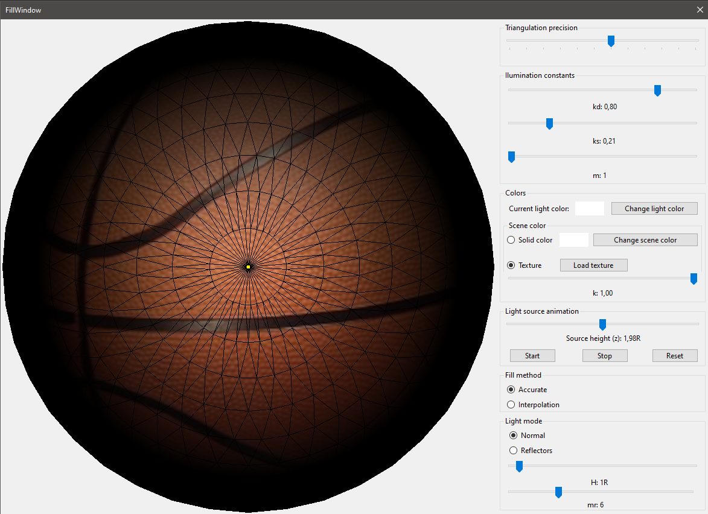

# Illumination app
An application written in C# using Windows Forms with .NET Core, which implement the Lambert illumination model. The app is also using a custom algorithm for polygon filling (Scan-line filling). The application implements the Model View Presenter architectural pattern.

